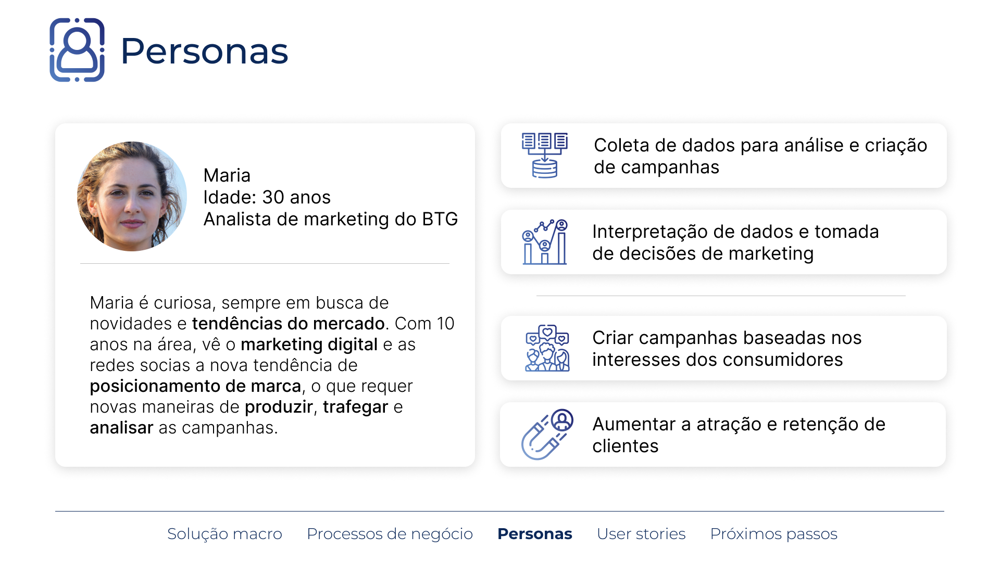
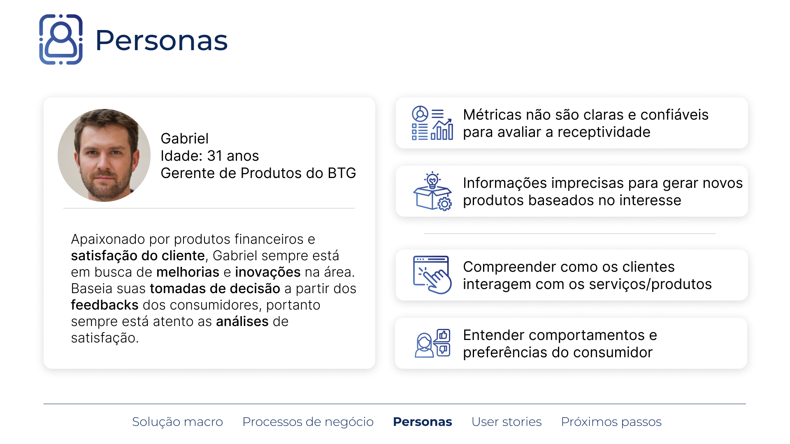

# Documento Principal do Projeto

Descrição sucinta do projeto, com descrição do problema, do objetivo e da solução em linhas gerais.

O desafio do BTG Pactual é fazer uma análise de sentimentos nas suas postagens do Instagram, visando entender se a visão do público sobre determinadas campanhas de marketing é boa ou ruim.
Assim com o AdTrack visamos classificar esses comentários em bons, neutros ou ruins com base em um modelo de processamento de linguagem natural (NLP).
De tal modo que seja possível tomar decisões a respeito das campanhas de forma mais assertivas.

## (Sprint 1) Entendimento do Negócio

### **Matriz de Avaliação de Valor (Oceano Azul)**

**A matriz é utilizada para visualizar, a partir de demais players do mercado, possibilidades a serem exploradas e que podem criar vantagem competitiva. Dessa forma, foram analisados os seguintes aspectos: praticidade, usabilidade, métricas gerias e por post, métricas comparativas com outras contas, agendamento de post, métricas comparativas por post, preço e visualização em relatório. Tais players foram analisados em comparação com o AdTrack: mLabs, Instagram Analytics e Iconsquare.**

### **Análise financeira do projeto**

**Com base em entrevista com o parceiro do projeto, o banco BTG Pactual previu que, caso o projeto fosse desenvolvido internamente, o investimento médio seria de cerca de R$ 250 mil a R$ 300 mil. Essa cifra de investimento foi fornecida pelos responsáveis técnicos da empresa, os quais estimaram que seriam necessários cerca de 3 desenvolvedores plenos, em média 6 meses de desenvolvimento e toda a infraestrutura de cloud necessária para colocar o projeto em produção.**
**Devido ao fato de ser um projeto interno que visa entender melhor as reações do público em relação às campanhas de ativação de marketing, não haverá geração de caixa direta.**

## (Sprint 1) Entendimento da Experiência do Usuário

### **Personas**

### **1) Maria**

**Idade:** 30 anos

**Ocupação:** Analista de marketing do BTG

**DESCRIÇÃO:**

- Formada em marketing e possui 10 anos de experiência no mercado
- Trabalha na área de marketing do BTG

**PERSONALIDADE:**

- Curiosa e esta sempre em busca de novas informações e tendências de mercado para ajudar a tomar decisões informadas
- Costuma buscar inovações e soluções através da tecnologia

**OBJETIVOS:**

- **Gerar campanhas baseadas nos interesses dos consumidores**: Maria acredita que o sucesso de uma campanha de marketing está em sua capacidade de se conectar com os interesses e necessidades dos consumidores. Por isso, ela se esforça para criar campanhas personalizadas e relevantes que gerem valor para os clientes do banco BTG
- **Melhorar a atração e retenção de clientes**: Com base em suas análises, Maria trabalha em colaboração com sua equipe para desenvolver estratégias de marketing eficazes que atraiam novos clientes e mantenham os atuais satisfeitos e engajados.

**FRUSTRAÇÃO:**

- **Dificuldades na coleta de dados:** Maria fica frustrada com dificuldades de classificar os dados relevantes para suas análises de marketing, podendo prejudicar a eficácia de suas campanhas.
- **Dificuldades na interpretação de dados:** Maria tem dificuldade em interpretar dados e informações de mercado, o que pode afetar negativamente a capacidade do banco de tomar decisões de marketing informadas. Devido a subjetividade de alguns comentarios , sendo filtro de dados e classificação do mesmo.

### **2) Gabriel**

**Idade:** 31 anos

**Ocupação:** Gerente de produto do BTG

**DESCRIÇÃO:**

- Formado em administração  e possui 11 anos de experiência no mercado
- Trabalha na área de gestão de produto BTG

**PERSONALIDADE:**

- Ele é apaixonado por produtos financeiros e está sempre buscando novas maneiras de melhorar a oferta do banco para seus clientes
- Gabriel é muito atento aos clientes em relação aos produtos do BTG. Ele está sempre está monitorando as reações e feedback dos clientes para saber o que eles pensam sobre os produtos e serviços do banco, e para garantir que a empresa esteja sempre oferecendo produtos de qualidade e eficazes

**OBJETIVOS:**

- Gabriel busca compreender o que os clientes do banco BTG valorizam e como eles interagem com os produtos e serviços oferecidos
- Entender os comportamentos e preferências do consumidor para melhorar a atração e retenção de clientes

**FRUSTRAÇÕES:**

- Avaliar performance de campanhas para tomadas de decisões mais rápidas, reduzindo custo e direcionando a campanha para a melhor eficiência. Gabriel pode enfrentar frustrações em avaliar a performance de campanhas de produto para tomar decisões mais rápidas e eficazes.Ainda assim carlos pode enfrentar problemas se os dados não corresponderem a nova campanha. Isso ocorre quando as  métricas não são claras e confiáveis para avaliar a receptividade dos produtos
- Gerar campanhas baseadas nos interesses dos consumidores: Gabriel pode enfrentar desafios em gerar novos produtos baseadas nos interesses dos consumidores. Isso pode ser difícil se não houver informações precisas sobre os interesses e tendências dos clientes ou se as informações estiverem desatualizadas

## **User Story**

<table><tbody><tr><td><strong>Número</strong></td><td>User story 1</td></tr><tr><td><strong>Épico</strong></td><td>Análise de sentimento dos comentários em postagens do BTG Pactual no Instagram. </td></tr><tr><td><strong>Persona</strong></td><td>Analista de Marketing do BTG Pactual </td></tr><tr><td><strong>História</strong></td><td>
Eu, como usuário do sistema, quero uma ferramenta de análise de sentimento que possa identificar automaticamente se os comentários em postagens do BTG Pactual são positivos, negativos ou neutros, para que eu possa entender como os clientes estão reagindo às postagens do banco.

  
</td></tr><tr><td><strong>Critérios de aceitação</strong></td><td><strong>Critério 1: </strong>A ferramenta deve ser capaz de identificar automaticamente se um comentário é positivo, negativo ou neutro. </td></tr><tr><td><strong>Testes de aceitação</strong></td><td>
<strong>Teste 1 para o critério 1: </strong>A ferramenta identifica corretamente um comentário positivo. 
<ul><li>Conseguiu: correto. </li><li>Não conseguiu: errado, essa funcionalidade precisa ser corrigida.</li></ul>
<strong>Teste 2 para o critério 1: </strong>A ferramenta precisa ter uma acurácia de, no mínimo, 80%. 
<ul><li>Conseguiu: correto, o modelo tem uma acurácia satisfatória. </li><li>Não conseguiu: errado, essa funcionalidade precisa ser corrigida.</li></ul></td></tr></tbody></table>

<table><tbody><tr><td><strong>Número</strong></td><td>User story 2</td></tr><tr><td><strong>Épico</strong></td><td>Análise de sentimento dos comentários em postagens do BTG Pactual no Instagram.</td></tr><tr><td><strong>Persona</strong></td><td>Analista de Marketing do BTG Pactual </td></tr><tr><td><strong>História</strong></td><td>Eu, como usuário do sistema, quero ter acesso a uma interface de fácil utilização que me permita visualizar os resultados da análise de sentimento de forma clara e compreensível, como gráficos ou relatórios, para que eu possa interpretar os dados facilmente e tomar decisões informadas de marketing. </td></tr><tr><td><strong>Critérios de aceitação</strong></td><td><strong>Critério 1: </strong>A interface deve ser fácil de usar e permitir visualizar os resultados da análise de sentimento de forma clara e compreensível, como gráficos ou relatórios.</td></tr><tr><td><strong>Testes de aceitação</strong></td><td>
<strong>Teste 1 para o critério 1: </strong>A interface deve ter uma navegação intuitiva e fácil de usar. 
<ul><li>Conseguiu: correto, a interface é fácil de usar e permite visualizar os resultados de forma clara. </li><li>Não conseguiu: errado, a interface precisa ser melhorada para facilitar a navegação e visualização dos resultados. </li></ul>
  

<strong>Teste 2 para o critério 1: </strong>Os gráficos e relatórios devem ser compreensíveis e mostrar os resultados da análise de sentimento de forma clara. 
<ul><li>Conseguiu: correto, os gráficos e relatórios mostram os resultados da análise de sentimento de forma clara e compreensível. </li><li>Não conseguiu: errado, os gráficos e relatórios precisam ser melhorados para mostrar os resultados de forma clara e compreensível.</li></ul></td></tr></tbody></table>

<table><tbody><tr><td><strong>Número</strong></td><td>User story 3</td></tr><tr><td><strong>Épico</strong></td><td>Análise de Sentimento em Tempo Real para Postagens do BTG Pactual</td></tr><tr><td><strong>Persona</strong></td><td>Analista de Marketing do BTG Pactual </td></tr><tr><td><strong>História</strong></td><td>Eu, como usuário do sistema, quero que a ferramenta seja capaz de processar grandes volumes de comentários em tempo real, para que eu possa obter insights em tempo hábil sobre a percepção dos clientes em relação às postagens do BTG Pactual. </td></tr><tr><td><strong>Critérios de aceitação</strong></td><td><strong>Critério 1: </strong>A ferramenta deve ser capaz de processar pelo menos 200 comentários por hora em tempo real, sem atrasos significativos. </td></tr><tr><td><strong>Testes de aceitação</strong></td><td>
<strong>Teste 1 para o critério 1:</strong> Inserir 200 comentários fictícios em um teste da ferramenta e avaliar se ela é capaz de processá-los em um período de 2 horas, sem atrasos significativos. 
<ul><li>Conseguiu: correto, a ferramenta é capaz de processar pelo menos 100 comentários por hora em tempo real. </li><li>Não conseguiu: errado, a ferramenta não é capaz de processar e será preciso otimizar.</li></ul></td></tr></tbody></table>

<table><tbody><tr><td><strong>Número</strong></td><td>User story 4</td></tr><tr><td><strong>Épico</strong></td><td>Melhorar a análise de dados do BTG Pactual</td></tr><tr><td><strong>Persona</strong></td><td>Gerente de Produtos do BTG Pactual </td></tr><tr><td><strong>História</strong></td><td>Eu, como usuário do sistema, quero que a ferramenta seja capaz de identificar palavras-chave relevantes nos comentários dos clientes, para que eu possa entender os principais tópicos de discussão e identificar tendências emergentes.</td></tr><tr><td><strong>Critérios de aceitação</strong></td><td><strong>Critério 1: </strong>A ferramenta deve ser capaz de identificar palavras-chave relevantes em cada comentário.  <strong>Critério 2: </strong>As palavras-chave identificadas pela ferramenta devem ser precisas e relevantes para os tópicos de discussão.</td></tr><tr><td><strong>Testes de aceitação</strong></td><td>
<strong>Teste 1 para o critério 1: </strong>A ferramenta é testada com um conjunto de 10 comentários, e a identificação de pelo menos 5 palavras-chave relevantes é verificada. 
<ul><li>Conseguiu: correto, a ferramenta identificou pelo menos 5 palavras-chave em todos os 10 comentários. </li><li>Não conseguiu: errado, a ferramenta não identificou e será preciso otimizar.  </li></ul>
  

<strong>Teste 1 para o critério 2:</strong> A ferramenta é testada com um conjunto de 10 comentários, e há precisão e relevância das palavras-chave identificadas. 
<ul><li>Conseguiu: correto, todas as palavras-chave identificadas são precisas e relevantes.</li><li>Não conseguiu: errado, pelo menos uma das palavras-chave identificadas é imprecisa ou irrelevante. </li></ul></td></tr></tbody></table>

<table><tbody><tr><td><strong>Número</strong></td><td>User story 5 <i>(Nice to Have)</i></td></tr><tr><td><strong>Épico</strong></td><td>Melhorar a acessibilidade e usabilidade do BTG Pactual</td></tr><tr><td><strong>Persona</strong></td><td>Gerente de Produtos do BTG Pactual </td></tr><tr><td><strong>História</strong></td><td>Eu, como usuário do sistema, quero que a interface seja responsiva e amigável para uso em dispositivos móveis, para que eu possa acessar e utilizar a ferramenta em qualquer lugar.</td></tr><tr><td><strong>Critérios de aceitação</strong></td><td>
<strong>Critério 1: </strong>A interface deve ser responsiva e se adaptar a diferentes tamanhos de tela e dispositivos móveis. 

<strong>Critério 2:</strong> A interface deve ser amigável e intuitiva para o uso em diferentes dispositivos.
</td></tr><tr><td><strong>Testes de aceitação</strong></td><td>
<strong>Teste 1 para o critério 1:</strong> A interface é testada em diferentes dispositivos (por exemplo, smartphones, notebooks e tablets).
<ul><li>Conseguiu: correto, a interface se adapta de forma responsiva a todos os tamanhos de tela e dispositivos testados. </li><li>Não conseguiu: errado, a interface não se adapta de forma responsiva e será preciso otimizar. </li></ul>
  

<strong>Teste 1 para o critério 2: </strong>Vários usuários diferentes testam a interface e fornecem feedback sobre sua amigabilidade e intuitividade. 
<ul><li>Conseguiu: correto, a interface é considerada amigável e intuitiva pela maioria dos usuários que testaram. </li><li>Não conseguiu: errado, pelo menos três usuários consideram a interface pouco amigável ou não intuitiva.</li></ul></td></tr></tbody></table>

<table><tbody><tr><td><strong>Número</strong></td><td>User story 6 <i>(Nice to Have)</i></td></tr><tr><td><strong>Épico</strong></td><td>Melhorar a análise de dados do BTG Pactual</td></tr><tr><td><strong>Persona</strong></td><td>Gerente de Produtos do BTG Pactual </td></tr><tr><td><strong>História</strong></td><td>Eu, como usuário do sistema, quero que a interface seja responsiva e amigável para uso em dispositivos móveis, para que eu possa acessar e utilizar a ferramenta em qualquer lugar.</td></tr><tr><td><strong>Critérios de aceitação</strong></td><td>
<strong>Critério 1: </strong>A ferramenta deve permitir a seleção e comparação de pelo menos duas campanhas diferentes. 

<strong>Critério 2:</strong> A ferramenta deve apresentar a análise de sentimento de cada campanha de forma clara e fácil de entender. 

<strong>Critério 3: </strong>A ferramenta deve permitir a visualização da comparação entre as análises de sentimento de cada campanha.
</td></tr><tr><td><strong>Testes de aceitação</strong></td><td>
<strong>Teste 1 para o critério 1: </strong>O usuário tenta selecionar e comparar pelo menos duas campanhas diferentes. 
<ul><li>Conseguiu: correto, a ferramenta permite comparar pelo menos duas campanhas diferentes. </li><li>Não conseguiu: errado, a ferramenta não permite a comparação e será necessário aprimorar. </li></ul>
<strong>Teste 1 para o critério 2: </strong>O usuário examina as análises de sentimento de cada campanha selecionada. 
<ul><li>Conseguiu: correto, a ferramenta apresenta as análises de sentimento de cada campanha de forma clara e fácil de entender. </li><li>Não conseguiu: errado, a ferramenta não apresenta as análises de sentimento de forma clara ou fácil de entender. </li></ul>
<strong>Teste 1 para o critério 3: </strong>O usuário examina a visualização da comparação entre as análises de sentimento de cada campanha. 
<ul><li>Conseguiu: correto, a ferramenta permite visualizar a comparação entre as análises de sentimento de cada campanha de forma clara e fácil de entender. </li><li>Não conseguiu: errado, a ferramenta não permite visualizar a comparação entre as análises de sentimento de forma clara ou fácil de entender.</li></ul></td></tr></tbody></table>

(Sprint 2) Modelo de Bag of Words (IPYNB)

Colocar o link do artefato (deve estar na pasta src do repositório do projeto).

## (Sprint 2) Documentação do Modelo de Bag of Words

Preencher conforme a descrição do artefato na Adalove.

## (Sprint 3) Modelo utilizando Word2Vec (IPYNB)

Colocar o link do artefato (deve estar na pasta src do repositório do projeto).

## (Sprint 3) Documentação do Modelo utilizando Word2Vec

Preencher conforme a descrição do artefato na Adalove.

## (Sprint 4) Proposta de uma nova modelagem utilizando novas features (IPYNB)

Colocar o link do artefato (deve estar na pasta src do repositório do projeto).

## (Sprint 4) Documentação da proposta de uma nova modelagem

Preencher conforme a descrição do artefato na Adalove.

## (Sprint 5) Apresentação Final

Colocar o link do artefato (deve estar na pasta apresentacoes do repositório do projeto).

## (Sprint 5) Deploy do melhor modelo

Colocar o link dos artefatos (devem estar nas pastas videos e src do repositório do projeto).

## (Sprint 5) Documentação da Solução

Preencher conforme a descrição do artefato na Adalove.
