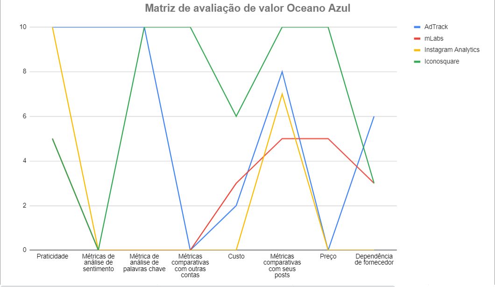
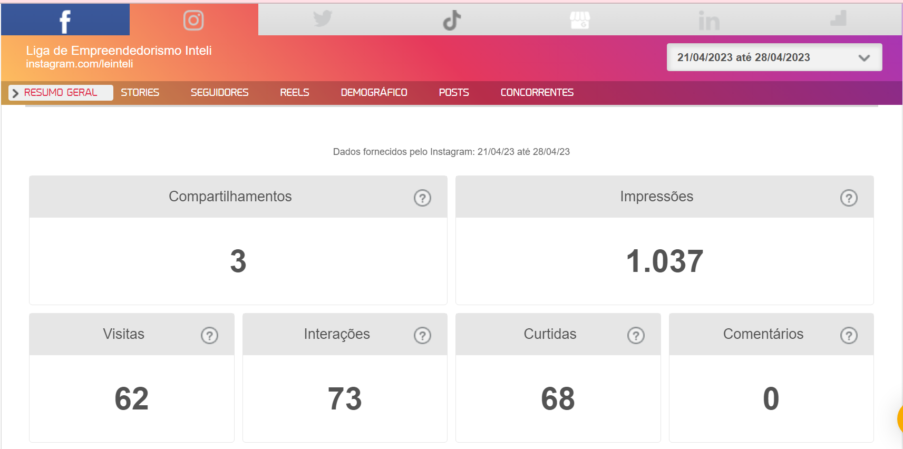
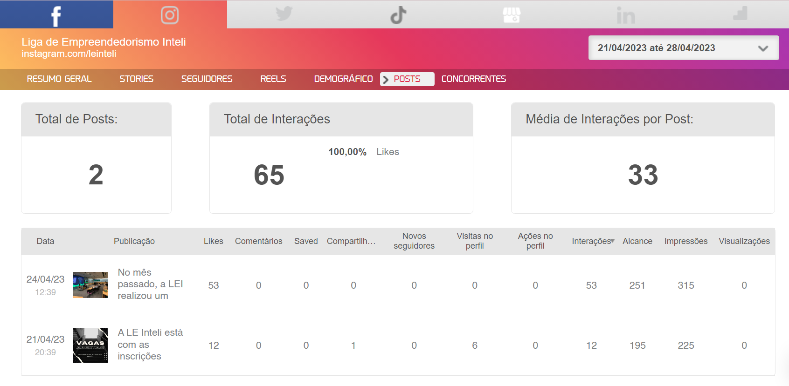
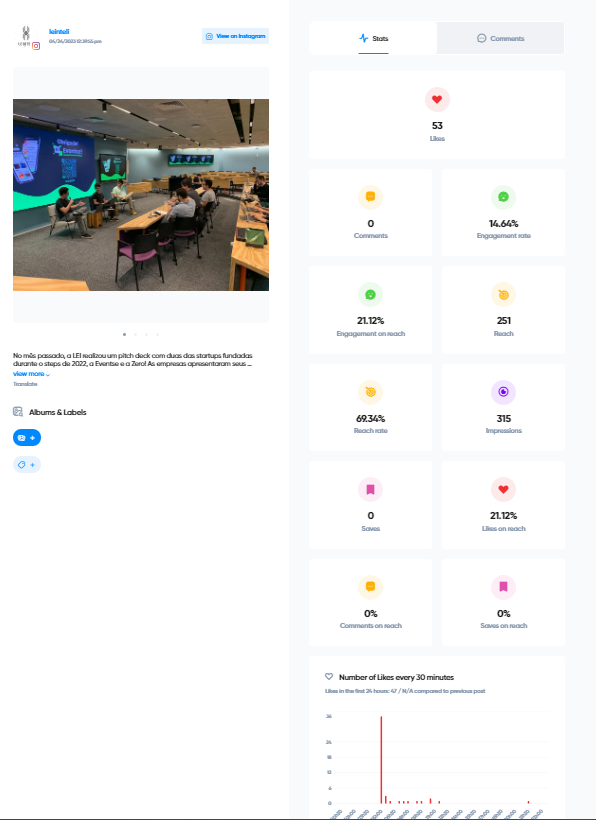
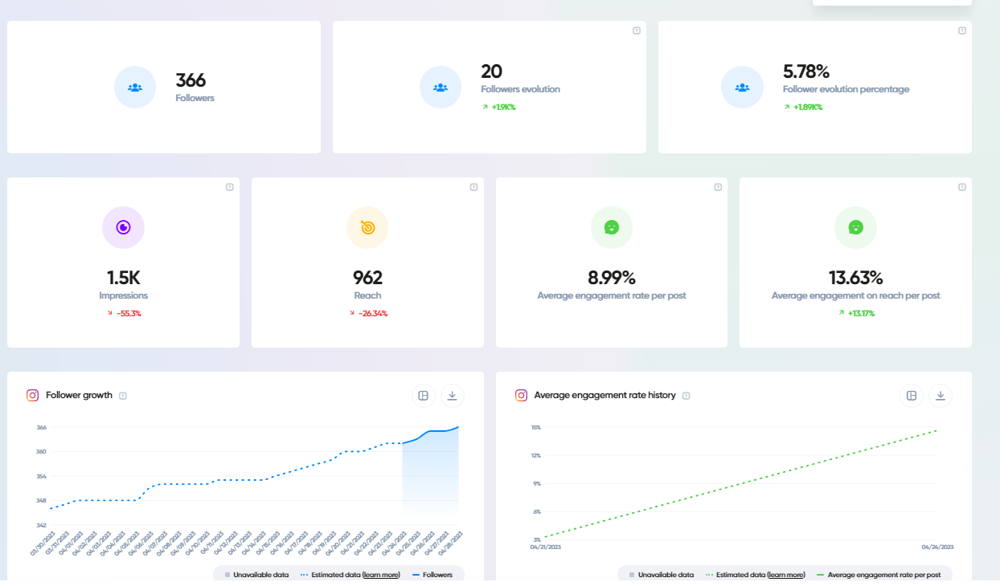
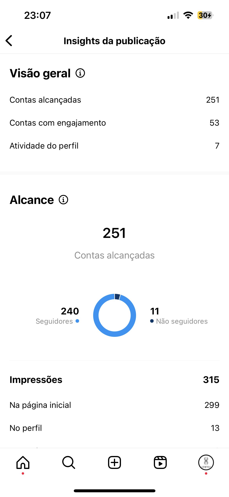
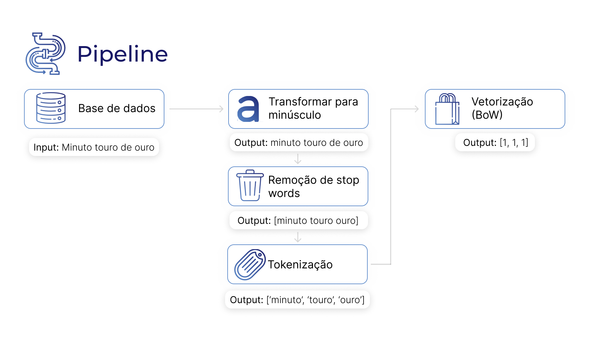
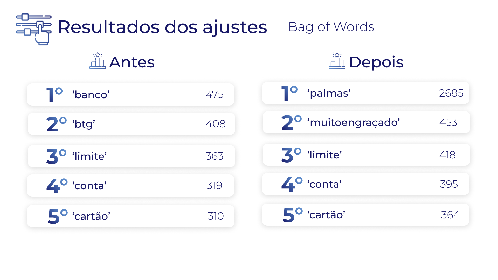
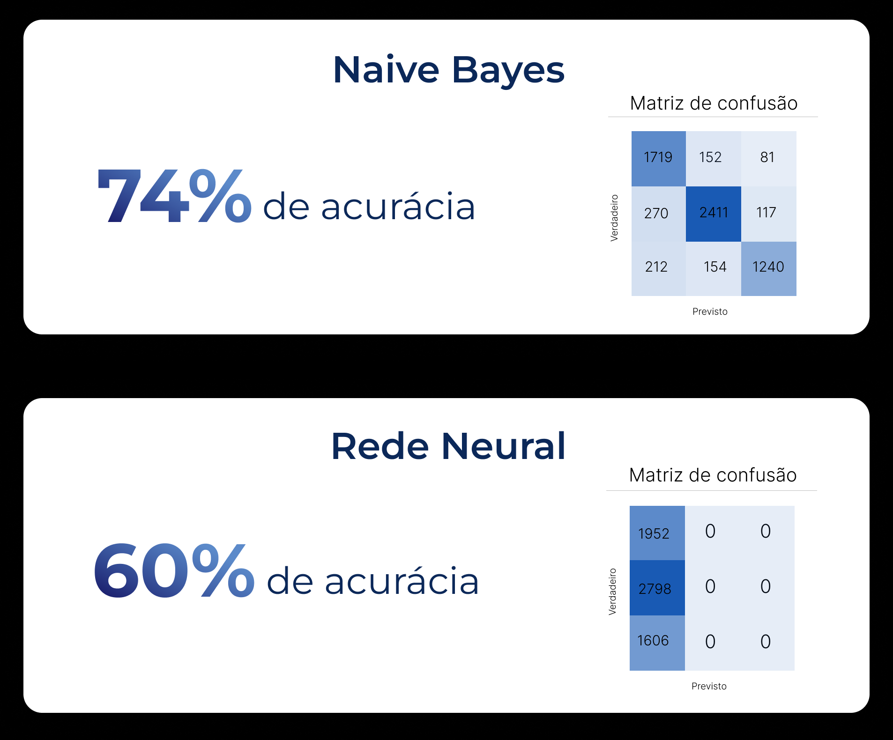
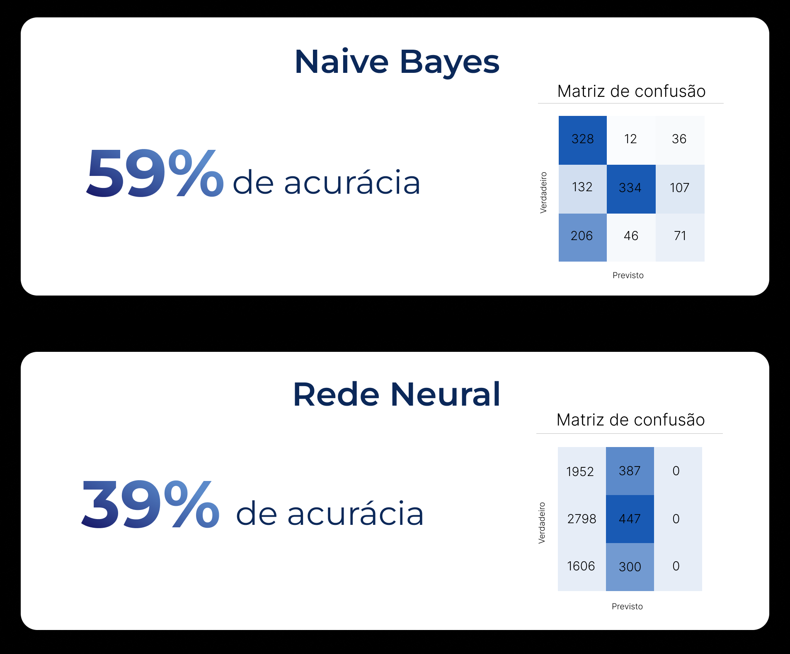

# Documento Principal do Projeto

O desafio do BTG Pactual é fazer uma análise de sentimentos nas suas postagens do Instagrama partir dos comentários, visando entender se a visão do público sobre determinadas campanhas de marketing é positiva, negativa ou neutra.
Assim, com o AdTrack, visamos classificar esses comentários em bons, neutros ou ruins, e extrair as palavras-chave destes, com base em um modelo de processamento de linguagem natural (NLP), de tal modo que seja possível tomar decisões a respeito das campanhas de marketing e acerca dos produtos e serviços do banco de forma mais assertiva.

## (Sprint 1) Entendimento do Negócio

### [**Matriz de Avaliação de Valor (Oceano Azul)**](https://docs.google.com/spreadsheets/d/1efPgxxEptiqPRB1AfTgmY_iF861oDFa0/edit?usp=sharing&ouid=102062215505800350720&rtpof=true&sd=true)

A matriz é utilizada para visualizar, a partir de demais players do mercado, possibilidades a serem exploradas e que podem criar vantagem competitiva. Dessa forma, foram analisados os seguintes aspectos: praticidade, métricas de análise de sentimento, métricas de análise de palavras chave, métricas comparativas com outras contas, custo, métricas comparativas com seus próprios posts, preço e dependência de fornecedor. Tais players foram analisados em comparação com o AdTrack: mLabs, Instagram Analytics e Iconsquare.



Matriz de Avaliação de Valor - Imagem 1

Portanto, é possível concluir tais aspectos:

1. Por ser um sistema utilizado internamente pela equipe da empresa, ele é de mais fácil acesso, se tornando mais prático e, por isso, **AUMENTOU** tal atributo. O Instagram Analytics, por ser interno do Instagram, também é prático, diferente de serviços terceiros que requer a criação de conta, pagamento, conexão com conta do Instagram e Facebook, como é o caso do mLabs e Iconosquare.
2. Diferente dos competidores, o AdTrack criou métricas de análise de sentimentos dos comentários feitos nas postagens, mostrando quais sentimentos cada campanha gerou no seguidores. Portanto, ao **CRIAR**, o AdTrack tem vantagem competitiva, gerando mais valor.
3. O AdTrack **CRIOU** tal atributo, visto que os demais serviços não fornecem a análise de palavras chaves extraídas dos comentários feitas nas públicações.
4. O AdTrack não possui métricas comparativas das campanhas de marketing com demais contas, sendo o Iconosquare a única que possui tal serviço, por isso o AdTrack **ELIMINOU** esse atributo, por não ter sido requisitado pelo cliente.
5. O Instagram Analytics é a própria ferramenta de análise do Instagram, portanto não possui custo. Já as plataformas Iconosquare e mLabs são serviços terceiros, que possuem mensalidade de 49 euros e 29,90 reais, respectivamente. O AdTrack, por ser um serviço interno, possui custos de manutenção e utilização, o que representa ser maior que os demais, assim sendo um aspecto que deve ser **REDUZIDO**.
6. A ferramenta nativa do Instagram possui métricas de comparativo de posts. O mLabs fornece as mesmas ferramentas do Instagram Analytics, portanto possuem mesma pontuação. O Iconosquare tem diferentes métricas mais detalhadas, sobre a quantidade de likes a cada 30 minutos, por exemplo. O AdTrack pode seguir algumas métricas da Iconosquare e oferecer, em tempo real, **AUMENTANDO**\-**AS**, mais detalhadas sobre a postagem que o próprio Instagram não oferece.
7. Visto que os serviços terceiros cobram preços mensais para o uso, o AdTrack **ELIMINOU** tal atributo, já que ele será nativo do sistema da empresa, não tendo que pagar um preço para uma outra empresa.
8. Para diminuir os custos e melhorar a eficiência do produto, o AdTrack pode **ELIMINAR** a dependência de fornecedor, ou seja, de base de dados do seu administrador, com a possibilidade de aumentar os dados e permitindo criar novas métricas comparativas.

A seguir é possível ver mais cada serviço que foi utilizado na matriz para comparar com a solução a ser desenvolvida. Foram criadas contas no mLabs e Iconosquare para realizar a pesquisa:

 

Relatórios do mLabs - Imagens 2 e 3

 

Relatórios do Iconosquare - Imagens 4 e 5

  

Relatórios do Instagram Analytics - Imagens 6, 7 e 8

(Sprint 1) Entendimento da Experiência do Usuário

### **Personas**

### **1 Maria**

O Bag of Words é uma técnica de linguagem natural útil para criar um conjunto não ordenado de palavras. Dessa forma, o Bag of Words será importante para a análise de sentimentos porque, com ele, será possível vetorizar e comparar as similaridades ou diferenças com base na frequência de repetição de cada palavra:

O documento contendo a descrição técnica está disponível no seguinte link: https://github.com/2023M6T4-Inteli/Projeto4/blob/Dev/descri%C3%A7%C3%A3oT%C3%A9cnica.md

## (Sprint 2) Documentação do Modelo de Bag of Words

### Fluxograma de processamento (pipeline)

Para a aplicação da técnica Bag Of Words, são necessárias algumas etapas de pré processamento de dados não estruturados, apresentadas na figura abaixo e serão descritas em mais detalhes a seguir.


- **Tokenização** : Nesta primeira etapa, o texto é, primeiramente, todo colocado em minúsculo independente da palavra e, logo em seguida, é feito um loop que itera por toda a frase e transforma cada palavra em um elemento da array.
  Assim, é mais fácil para o modelo enxergar cada palavra com um único elemento de uma array, facilitando iterações futuras.

```python
['eu','gosto','de','sorvete','de','pistache']
```

- **Remoção de Stop Words** : Durante essa fase do processo são removidas todas as palavras que não agregam valor semântico ao texto, como por exemplo "o", "a","eu" e etc.
  Fazendo isso, o modelo consegue entender melhor o significado de cada frase para a posterior análise de sentimentos.

```python
['gosto','sorvete','pistache']
```

- **Vetorização bag of words** : A última etapa desse processamento, consiste em tornar o texto uma matrix de vetores e contar quantas vezes determinada palavra aparece no corpus.

```python
['gosto','sorvete','pistache']
[1,1,1]
```

As técnicas implementadas e descritas acima no pipeline estão descritas detalhadamente no seguinte documento: https://github.com/2023M6T4-Inteli/Projeto4/blob/Dev/descri%C3%A7%C3%A3oT%C3%A9cnica.md

## (Sprint 3) Modelo utilizando Word2Vec (IPYNB)

Colocar o link do artefato (deve estar na pasta src do repositório do projeto).

## (Sprint 3) Documentação do Modelo utilizando Word2Vec

Em concordância com os feedbacks recebidos durante a Sprint Review 2 e as atividades propostas para esta sprint, foram realizadas diversas atividades que envolvem melhorias no pré processamento e continuidade na modelagem de processamento de linguagem natural para análise de sentimentos, agora referente ao Word2Vec. Tais atividades são apresentadas abaixo em mais detalhes.

### Ajustes do pré processamento

Na Sprint 2, foram realizados a limpeza da base de dados, removendo ações que não se referiam a comentários e que foram publicados pelos autor @btgpactual, passagem de todas as letras para minúsculas, remoção de stop words a partir das fornecidas da biblioteca NLTK e tokenização. A partir dos feedbacks coletados pelo parceiro BTG Pactual, as seguintes mudanças foram realizadas nessa Sprint:

* Adição de novas stop words: criou-se uma lista com stop words personalizadas ('banco', 'btg', 'brg', 'pactual', 'btgpactual','pq', 'q', 'pra', 'vcs', 'vc', 'i', 'p', 'kkk', 'y', 'of', 'n') e que foi somada junto a biblioteca do NLTK;
* Tratamento de emojis: visto que a maioria de comentários em rede sociais tem em sua composição emojis, mostrou-se uma necessidade de utilizá-los para a criação do modelo PLN e, portanto, criou-se um dicionário de emojis para português, utilizando seu resultado no restante do pré processamento;
* Label encoding da coluna de sentimento: a classificação dos comentários é feita pela coluna sentimento com as tags: POSITIVE, NEGATIVE e NEUTRAL. Para poder utilizá-la nos modelos, as tags foram transformadas para 0 (negativo), 1 (neutro) e 2 (positivo) utilizando a label enconding.

Essas mudanças no pré processamento dos dados resultou em significativas diferenças no resultado final, que pode ser visualizado na imagem a seguir:



### Modelos com Bag of Words

Realizado na Sprint 2, o BoW é uma técnica de Processamento de Linguagem Natural que cria um vocabulário de palavras, referentes ao input, e retorna uma matriz de vetores dessas palavras. Dessa forma, foi produzido um CSV de vetores das frases junto com sua respectiva tag de sentimento, pois os modelos utilizam de dados numéricos para funcionarem e, dessa maneira, tal tratamento foi utilizado para trasnformar os dados não estruturados (texto) para estruturados (números). Dois modelos foram feitos, portanto, utilizando o Bag of Words:

1. Naive Bayes: utilizado com a variante Bernoulli do Naive Bayes os recursos são representados por variáveis discretas que podem assumir apenas dois valores (booleano), normalmente 0 ou 1, representando afirmativa ou negativa de uma condição, nesse caso do tipo de sentimento do comentário. Para melhorar a performance e robustez do modelo, foi aplicada a técnica de cross validation, em que o conjunto de dados é dividido em k partes (chamadas de folds) e o modelo é treinado k vezes, onde em cada iteração, um dos folds é utilizado como conjunto de teste e o restante como conjunto de treinamento. A métrica de avaliação é então calculada a partir das k iterações. Na aplicação desse modelo, utilizamos de 5 folds e, assim, obtendo uma acurácia de 74% e uma matriz de confusão que apresenta poucos falsos positivos e falsos negativos.
2. Rede Neural: aplicada utilizando a biblioteca Keras, a rede neural utilizada é Sequencial, em que permite a adição subsequente de camadas. O modelo aplicado utilizou duas camadas densas, sendo a primeira de entrada com 64 neurônios e função de ativação ReLU, que recebe um vetor de tamanho igual ao número de recursos (colunas) da matriz obtida com o Bag of Words. Por outro lado, a segunda camada é de saída, composta por um único neurônio e que utiliza da função de ativação sigmóide. Para melhorar a performance do modelo, foi aplicado o otimizador Adam, que ajusta os pesos da rede durante o treinamento com base na taxa de aprendizado especificada (0.001).  Por fim, para treinar esse modelo, foram utilizadas 20 épocas e ocm tamanho de lote de 64, o que resultou em uma acurácia de 60%, mas uma tendência de falso negativo para os dados classificados como positivos para o modelo. Os resultados obtidos com os modelos podem ser vistos na imagem abaixo:

   

   Por fim, comparando os dois modelos aplicados, conclui-se que o Naive Bayes, apesar de mais simples, obteve melhor desempenho, com uma acurácia maior e adequada à aplicação do Bag of Words, representando poucos erros de falsos negativos e  falsos positivos aos dados, sendo a melhor escolha entre os dois, pela menor complexidade e tempo de resposta e maior acurácia aos dados de treinamento e teste.

### Word2Vec e seus modelos

O Word2Vec é um modelo de aprendizado de máquina utilizado para representar palavras como vetores em um espaço vetorial de muitas dimensões. Esse algoritmo foi inventado em 2013 por engenheiros do Google e com ele é possível classificar cada palavra em um espaço vetorial finito e realizar operações matemáticas simples com n palavras para buscar graus de similaridades entre as mesmas.

No presente projeto, o Word2Vec foi empregado de duas formas: em primeiro plano, utilizando como base todas as palavras obtidas nos comentários, ou seja, na coluna 'texto', já preveiamente tratada do DataFrame, buscando relações de similaridade entre as mesmas e, em segundo plano, foi utilizanda uma base vetorizada pré treinada fornecida pelo Núcleo Interinstitucional de Linguística Computacional (NILC) da Universidade de São Paulo (USP).

Para treinar o modelo com o dataset fornecido pelo stakeholder BTG Pactual, utilizou-se a biblioteca Gensim, que transforma as palavras em vetores. O modelo foi treinado utilizando as palavras contidas na base de dados disponível, e posteriormente aplicado às frases processadas. Durante esse processo, o modelo captura os vetores correspondentes a cada palavra presente na frase e os soma. Os primeiros 50 vetores resultantes são, então, armazenados em colunas específicas, o que proporciona uma representação compacta e numérica das frases, tornando-as adequadas para análises e tarefas de aprendizado de máquina.

Já para utilizar a vetorização pré treinada pelo NILC é necessário baixar o arquivo .txt, que está no site do mesmo, e carregar a base no modelo (para mais detalhes dessa etapa, consulte o arquivo .ipynb na pasta "scr" em que todo o passo a passo está documentando). Assim, após o download da base do NILC, é repetido o mesmo processo citado no parágrafo acima e são obtidas as 50 colunas que representam o vetor de cada frase.

Essa abordagem baseada no Word2Vec e na biblioteca Gensim possibilitou a obtenção de representações vetoriais para as palavras, as quais foram aplicadas às frases processadas. Ao realizar a soma dos vetores das palavras em cada frase, obtemos uma representação geral da mesma e essa representação compacta é armazenada nas colunas criadas para esse propósito, permitindo uma análise mais eficiente e possibilitando a utilização dos primeiros 50 vetores resultantes em tarefas subsequentes. Com essa abordagem, é possível explorar as relações semânticas e contextuais entre as palavras, obtendo insights valiosos a partir das frases contidas em nosso banco de dados.

Por fim, ao serem feitas as respectivas análises de acurácia do modelo com o Naive Bayes, a mudança dos resultados obtidos com as duas vetorizações foram insignificantes. O modelo que utilizou o corpus obteve uma acurácia de 59% e o com a base pré treinada foi de 57%. Assim, futuros ajustes são necessários para obter uma melhor acurácia do modelo e permitir com que as classificações sejam mais acertivas.  Os resultados obtidos podem ser vistos na imagem abaixo:



Por fim, é possível perceber que, mesmo com uma acurácia mais baixa que o modelo Naive Bayes utilizando Bag of Words, a matriz de confusão do mesmo modelo com a técnica de Word2Vec demonstrou ser positiva em relação ao objetivo central do projeto: identificar os comentários negativos para tratá-los e, de tal maneira, o modelo tendeu a identificar negativos, o que ocasionou na ocorrência de falso negativo nos comentários positivos, o que não acarreta grandes problemas no projeto.

As técnicas implementadas e descritas acima têm sua análise detalhada no seguinte documento:
https://github.com/2023M6T4-Inteli/Projeto4/blob/Dev/analisesSprint3.md

Como conclusão, pode-se entender que, em primeiro momento, a utilização da técnica Bag of Words nos modelos obteve um melhor resultado do que a Word2Vec, mas ainda há onde melhorar e, de tal maneira, os próximos passos do desenvolvimento visam a melhoria da base de dados e aplicação de novas técnicas e modelos nas duas abordagens para a definição do modelo final.

## (Sprint 4) Proposta de uma nova modelagem utilizando novas features (IPYNB)

Colocar o link do artefato (deve estar na pasta src do repositório do projeto).

## (Sprint 4) Documentação da proposta de uma nova modelagem

Preencher conforme a descrição do artefato na Adalove.

## (Sprint 5) Apresentação Final

Colocar o link do artefato (deve estar na pasta apresentacoes do repositório do projeto).

## (Sprint 5) Deploy do melhor modelo

Colocar o link dos artefatos (devem estar nas pastas videos e src do repositório do projeto).

## (Sprint 5) Documentação da Solução

Preencher conforme a descrição do artefato na Adalove.
