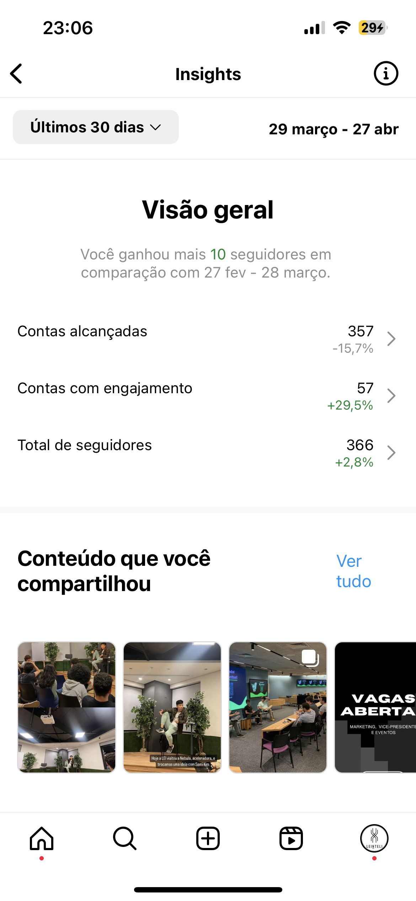

# Documento Principal do Projeto

O desafio do BTG Pactual é fazer uma análise de sentimentos nas suas postagens do Instagrama partir dos comentários, visando entender se a visão do público sobre determinadas campanhas de marketing é positiva, negativa ou neutra.
Assim, com o AdTrack, visamos classificar esses comentários em bons, neutros ou ruins, e extrair as palavras-chave destes, com base em um modelo de processamento de linguagem natural (NLP), de tal modo que seja possível tomar decisões a respeito das campanhas de marketing e acerca dos produtos e serviços do banco de forma mais assertiva.

## (Sprint 1) Entendimento do Negócio

### [**Matriz de Avaliação de Valor (Oceano Azul)**](https://docs.google.com/spreadsheets/d/1efPgxxEptiqPRB1AfTgmY_iF861oDFa0/edit?usp=sharing&ouid=102062215505800350720&rtpof=true&sd=true)

A matriz é utilizada para visualizar, a partir de demais players do mercado, possibilidades a serem exploradas e que podem criar vantagem competitiva. Dessa forma, foram analisados os seguintes aspectos: praticidade, métricas de análise de sentimento, métricas de análise de palavras chave, métricas comparativas com outras contas, custo, métricas comparativas com seus próprios posts, preço e dependência de fornecedor. Tais players foram analisados em comparação com o AdTrack: mLabs, Instagram Analytics e Iconsquare.


Matriz de Avaliação de Valor - Imagem 1

Portanto, é possível concluir tais aspectos:

1. Por ser um sistema utilizado internamente pela equipe da empresa, ele é de mais fácil acesso, se tornando mais prático e, por isso, **AUMENTOU** tal atributo. O Instagram Analytics, por ser interno do Instagram, também é prático, diferente de serviços terceiros que requer a criação de conta, pagamento, conexão com conta do Instagram e Facebook, como é o caso do mLabs e Iconosquare.
2. Diferente dos competidores, o AdTrack criou métricas de análise de sentimentos dos comentários feitos nas postagens, mostrando quais sentimentos cada campanha gerou no seguidores. Portanto, ao **CRIAR**, o AdTrack tem vantagem competitiva, gerando mais valor.
3. O AdTrack **CRIOU** tal atributo, visto que os demais serviços não fornecem a análise de palavras chaves extraídas dos comentários feitas nas públicações.
4. O AdTrack não possui métricas comparativas das campanhas de marketing com demais contas, sendo o Iconosquare a única que possui tal serviço, por isso o AdTrack **ELIMINOU** esse atributo, por não ter sido requisitado pelo cliente.
5. O Instagram Analytics é a própria ferramenta de análise do Instagram, portanto não possui custo. Já as plataformas Iconosquare e mLabs são serviços terceiros, que possuem mensalidade de 49 euros e 29,90 reais, respectivamente. O AdTrack, por ser um serviço interno, possui custos de manutenção e utilização, o que representa ser maior que os demais, assim sendo um aspecto que deve ser **REDUZIDO**.
6. A ferramenta nativa do Instagram possui métricas de comparativo de posts. O mLabs fornece as mesmas ferramentas do Instagram Analytics, portanto possuem mesma pontuação. O Iconosquare tem diferentes métricas mais detalhadas, sobre a quantidade de likes a cada 30 minutos, por exemplo. O AdTrack pode seguir algumas métricas da Iconosquare e oferecer, em tempo real, **AUMENTANDO**\-**AS**, mais detalhadas sobre a postagem que o próprio Instagram não oferece.
7. Visto que os serviços terceiros cobram preços mensais para o uso, o AdTrack **ELIMINOU** tal atributo, já que ele será nativo do sistema da empresa, não tendo que pagar um preço para uma outra empresa.
8. Para diminuir os custos e melhorar a eficiência do produto, o AdTrack pode **ELIMINAR** a dependência de fornecedor, ou seja, de base de dados do seu administrador, com a possibilidade de aumentar os dados e permitindo criar novas métricas comparativas.

A seguir é possível ver mais cada serviço que foi utilizado na matriz para comparar com a solução a ser desenvolvida. Foram criadas contas no mLabs e Iconosquare para realizar a pesquisa:

 

Relatórios do mLabs - Imagens 2 e 3

 

Relatórios do Iconosquare - Imagens 4 e 5

  

Relatórios do Instagram Analytics - Imagens 6, 7 e 8

(Sprint 1) Entendimento da Experiência do Usuário

### **Personas**

### **1 Maria**

O Bag of Words é uma técnica de linguagem natural útil para criar um conjunto não ordenado de palavras. Dessa forma, o Bag of Words será importante para a análise de sentimentos porque, com ele, será possível vetorizar e comparar as similaridades ou diferenças com base na frequência de repetição de cada palavra:

O documento contendo a descrição técnica está disponível no seguinte link: https://github.com/2023M6T4-Inteli/Projeto4/blob/Dev/descri%C3%A7%C3%A3oT%C3%A9cnica.md

## (Sprint 2) Documentação do Modelo de Bag of Words

### Fluxograma de processamento (pipeline)

Para a aplicação da técnica Bag Of Words, são necessárias algumas etapas de pré processamento de dados não estruturados, apresentadas na figura abaixo e serão descritas em mais detalhes a seguir.


- **Tokenização** : Nesta primeira etapa, o texto é, primeiramente, todo colocado em minúsculo independente da palavra e, logo em seguida, é feito um loop que itera por toda a frase e transforma cada palavra em um elemento da array.
  Assim, é mais fácil para o modelo enxergar cada palavra com um único elemento de uma array, facilitando iterações futuras.

```python
['eu','gosto','de','sorvete','de','pistache']
```

- **Remoção de Stop Words** : Durante essa fase do processo são removidas todas as palavras que não agregam valor semântico ao texto, como por exemplo "o", "a","eu" e etc.
  Fazendo isso, o modelo consegue entender melhor o significado de cada frase para a posterior análise de sentimentos.

```python
['gosto','sorvete','pistache']
```

- **Vetorização bag of words** : A última etapa desse processamento, consiste em tornar o texto uma matrix de vetores e contar quantas vezes determinada palavra aparece no corpus.

```python
['gosto','sorvete','pistache']
[1,1,1]
```

As técnicas implementadas e descritas acima no pipeline estão descritas detalhadamente no seguinte documento: https://github.com/2023M6T4-Inteli/Projeto4/blob/main/descri%C3%A7%C3%A3oT%C3%A9cnica.md

## (Sprint 3) Modelo utilizando Word2Vec (IPYNB)

### **Stop words customizadas**
 A adição de stop words customizadas elimina palavras específicas do domínio ou contexto do problema em questão, no qual  são selecionadas com base na análise prévia dos dados. Permitindo eliminar termos frequentes, mas irrelevantes, refinando o pré-processamento de texto e melhorando a qualidade dos resultados. A inclusão de stop words customizadas é especialmente útil em problemas específicos, onde certas palavras podem aparecer com frequência, mas não contribuem para a análise ou podem introduzir ruído nos resultados. Essa personalização das stop words permite um foco maior nas informações relevantes, aumentando a precisão e a eficiência da análise de texto.

Palavras que retiramos usando stopwords customizados :  'btg', 'pactual', 'btg pactual','pq', 'q', 'pra', 'vcs', 'vc', 'i', 'p', 'kkk', 'y', 'of', 'n'.

### **One hot coding coluna de sentimentos**

A técnica utilizada, conhecida como One Hot Coding, consiste em transformar uma coluna categórica em um conjunto de colunas binárias. No caso específico, a coluna de sentimento foi dividida em três novas colunas: neutro, positivo e negativo. Cada uma dessas colunas representa uma categoria de sentimento e recebe o valor 1 se o sentimento for correspondente à categoria da coluna, e 0 caso contrário. Essa transformação permite uma representação mais adequada dos diferentes sentimentos presentes na coluna original, facilitando a análise e processamento dos dados.

## (Sprint 3) Documentação do Modelo utilizando Word2Vec

Preencher conforme a descrição do artefato na Adalove.

## (Sprint 4) Proposta de uma nova modelagem utilizando novas features (IPYNB)

Colocar o link do artefato (deve estar na pasta src do repositório do projeto).

## (Sprint 4) Documentação da proposta de uma nova modelagem

Preencher conforme a descrição do artefato na Adalove.

## (Sprint 5) Apresentação Final

Colocar o link do artefato (deve estar na pasta apresentacoes do repositório do projeto).

## (Sprint 5) Deploy do melhor modelo

Colocar o link dos artefatos (devem estar nas pastas videos e src do repositório do projeto).

## (Sprint 5) Documentação da Solução

Preencher conforme a descrição do artefato na Adalove.
